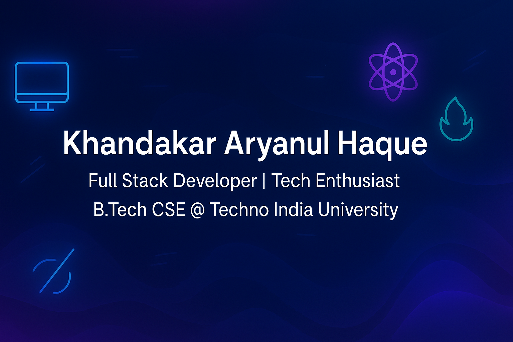

  

<h1 align="center">Hi 👋, I'm Khandakar Aryanul Haque</h1>
<h3 align="center">Full Stack Developer | Tech Enthusiast | B.Tech CSE @ Techno India University</h3>

---

## 🎓 Education
- **B.Tech in Computer Science & Engineering** – Techno India University, Kolkata (2026)

---

## 📝 About Me
- Skilled in **React, Next.js, Three.js, Node.js, Express, MongoDB, MySQL**
- Experienced in building **AI-based applications & SaaS platforms**
- Participated in **Smart India Hackathon 2024**
- Finalist in **Epitome 2025** & **Sustainovate 2025**
- Passionate about solving real-world problems with **clean UI, performance, and usability focus**

---

## ⚡ Tech Stack

---

## 🚀 Projects
- 🔹 <a href="https://ai-b2b-saas.onrender.com" target="_blank" rel="noopener noreferrer">AI B2B SaaS</a> – Social media & product analytics dashboard  
- 🔹 <a href="https://frontend-chatbot-u7pk.onrender.com/" target="_blank" rel="noopener noreferrer">AI-Chatbot</a> – Career guidance chatbot with 85% query resolution  
- 🔹 <a href="https://aryanul.github.io/Solar-System-3JS/" target="_blank" rel="noopener noreferrer">3D Solar System Simulation</a> – Interactive Three.js simulation  
- 🔹 <a href="https://parkit-frontend.onrender.com/" target="_blank" rel="noopener noreferrer">ParkIt</a> – Parking management platform (Web + Android)

---

## 📊 GitHub Stats

  
  

  

---

## 🔗 Connect with Me
  
  

